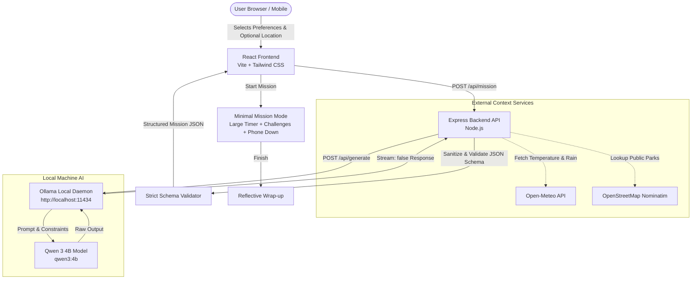

# 🌿 TouchGrass AI

> **"Your next adventure starts when you put your phone down."**  
> Personalized outdoor missions powered by local open-weight AI.

TouchGrass AI is an open-source web application designed to counter screen fatigue and doomscrolling by transforming generative AI into a catalyst for physical outdoor exploration. Using a locally running **Qwen 3 4B** model via **Ollama**, live weather metrics from **Open-Meteo**, and public green spaces from **OpenStreetMap**, TouchGrass AI crafts structured, sensory micro-missions that encourage users to put their devices away and reconnect with nature.

---

## 🏆 Hacktoberfest Open-Source AI Challenge
Built for the **Hacktoberfest Open-Source AI Challenge Week 1: Touch Grass**.

---

## The Problem

Modern digital life traps us in infinite feeds, algorithmic notifications, and endless screen fatigue. While technology often isolates people indoors, generative AI has the unique capability to synthesize creative prompts tailored to a user's current mood, available time, and surroundings. 

Instead of using AI to keep users glued to another screen, **TouchGrass AI turns AI into a bridge to the real world**—giving users an intentional reason to step outside, observe nature directly, and return mentally refreshed.

---

## What It Does

TouchGrass AI generates personalized outdoor micro-adventures based on:
- **Current State of Mind**: Relaxed, Stressed, Bored, Low Energy, Energetic, or Need a Mental Break.
- **Available Time**: Realistic itineraries scaled from quick 15-minute resets to 2+ hour excursions.
- **Difficulty & Intensity**: Easy strolls, moderate exploratory walks, or brisk physical movement.
- **Activity Style**: Nature observation, walking, running, photography, birding, gardening, or mindfulness.
- **Environmental Context**: Live temperature, wind speed, precipitation probability, and nearby public parks.

Every mission delivers:
1. An inspiring, structured title and objective.
2. **Exactly three actionable, sensory challenges** achievable within the target duration.
3. An explicit **Phone-Down Rule** requiring the device to be pocketed during the walk.
4. A practical **Safety Note** adapted to current terrain and weather conditions.

---

## Why Open AI?

TouchGrass AI is intentionally built on local open-weight AI rather than proprietary cloud APIs:

- **Local Inference with Ollama**: Core mission synthesis is executed entirely on your machine using **Qwen 3 4B** (`qwen3:4b`). No closed AI API keys (OpenAI, Anthropic, Google) or paid subscriptions are required.
- **Privacy & Ownership**: Your personal mood, daily schedule, and reflection notes stay private on your device.
- **Model Flexibility**: Because the backend connects to Ollama's standard REST API, developers can easily swap or benchmark other open-weight models (e.g., Llama 3, Mistral, Phi).
- **Network Clarification**: 
  - **Core AI Inference** runs 100% locally once the model weights are downloaded via Ollama.
  - **Live Weather & Nearby Parks** utilize lightweight public APIs (Open-Meteo and OpenStreetMap Nominatim), which require an active internet connection.

---

## Features

- 🧠 **Local Open-Weight AI Generation**: Powered by `qwen3:4b` running via Ollama.
- ⛅ **Weather-Aware Missions**: Dynamically adapts tasks and precautions to real-time temperature, wind speed, and rain probability.
- 🌲 **Verified Nearby Green Spaces**: Integrates nearby public parks and nature reserves without hallucinating locations or trespassing.
- 📵 **Distraction-Free Mission Mode**: An ultra-minimal outdoor interface with a large countdown timer, readable challenge tasks, and a bold phone-down reminder.
- 🌿 **Calm & Anti-Addictive UX**: Free of streaks, gamification points, leaderboards, and infinite feeds.
- 📱 **Fully Responsive Design**: Optimized for mobile devices (375px+), tablets, and desktop displays.
- ♿ **Accessible & Nature-Inspired**: High-contrast typography, keyboard navigation, visible focus indicators, and reduced-motion support.

---

## Architecture



---

## Tech Stack

- **Frontend**: React 19, Vite, Tailwind CSS (v4), Vanilla JavaScript (No TypeScript)
- **Backend**: Node.js, Express, CORS, dotenv
- **AI Engine**: [Ollama](https://ollama.ai) running [Qwen 3 4B](https://ollama.com/library/qwen3:4b)
- **Context APIs**: [Open-Meteo](https://open-meteo.com) (Weather), [OpenStreetMap Nominatim](https://nominatim.openstreetmap.org) (Places)

---

## Requirements

Ensure you have the following installed on your system:
- **Node.js**: v18.0.0 or higher
- **npm**: v9.0.0 or higher
- **Git**
- **Ollama**: Download and install from [ollama.ai](https://ollama.ai)

---

## Installation

Clone the repository and install dependencies for both backend and frontend:

```bash
# 1. Clone repository
git clone https://github.com/RajBhokare/Hacktoberfest-Touchgrass_ai.git
cd Hacktoberfest-Touchgrass_ai

# 2. Install backend dependencies
cd server
npm install

# 3. Install frontend dependencies
cd ../client
npm install
cd ..
```

---

## Ollama Setup

1. Start the Ollama application or daemon on your machine:
   ```bash
   ollama serve
   ```
2. Pull the open-weight **Qwen 3 4B** model:
   ```bash
   ollama pull qwen3:4b
   ```
3. Verify that the model is available:
   ```bash
   ollama list
   ```

---

## Running Locally

Run the backend and frontend development servers in separate terminal windows:

### Terminal 1 — Backend (`server`):
```bash
cd server
npm run dev
# Server running at http://localhost:5000
```

### Terminal 2 — Frontend (`client`):
```bash
cd client
npm run dev
# Frontend running at http://localhost:5173
```

Open **`http://localhost:5173`** in your browser.

---

## Environment Variables

Default values are preconfigured for local development. If needed, copy `.env.example` files to `.env`:

### Backend (`server/.env.example`)
| Variable | Description | Default |
|---|---|---|
| `PORT` | Port for Express backend server | `5000` |
| `OLLAMA_HOST` | URL of local Ollama instance | `http://localhost:11434` |
| `OLLAMA_MODEL` | Ollama model identifier | `qwen3:4b` |

### Frontend (`client/.env.example`)
| Variable | Description | Default |
|---|---|---|
| `VITE_API_URL` | Base URL of TouchGrass Express API | `http://localhost:5000` |

---

## API Endpoints

### 1. General Health Check
- **Endpoint**: `GET /api/health`
- **Response**:
  ```json
  { "status": "ok", "service": "TouchGrass AI API" }
  ```

### 2. AI Subsystem Health
- **Endpoint**: `GET /api/ai/health`
- **Response**:
  ```json
  { "status": "ok", "provider": "Ollama", "model": "qwen3:4b", "local": true }
  ```

### 3. Current Weather
- **Endpoint**: `GET /api/weather?latitude=40.785091&longitude=-73.968285`
- **Response**:
  ```json
  {
    "temperature": 22,
    "apparentTemperature": 20,
    "windSpeed": 14,
    "rainProbability": 10,
    "condition": "Mainly clear"
  }
  ```

### 4. Nearby Places
- **Endpoint**: `GET /api/places?latitude=40.785091&longitude=-73.968285`
- **Response**:
  ```json
  [
    { "name": "Central Park", "type": "park", "distance": 0.4 }
  ]
  ```

### 5. Generate Mission
- **Endpoint**: `POST /api/mission`
- **Request Body**:
  ```json
  {
    "mood": "Stressed",
    "time": "30 min",
    "difficulty": "Easy",
    "activity": "Nature",
    "latitude": 40.785091,
    "longitude": -73.968285
  }
  ```
- **Response**:
  ```json
  {
    "title": "30-Minute Nature Reset",
    "duration": "30 min",
    "difficulty": "Easy",
    "description": "Reconnect with the natural world through mindful listening and sensory exploration.",
    "challenges": [
      "Walk 100 meters and notice at least 3 natural sounds without looking at your phone.",
      "Identify 2 different natural textures by observing safely.",
      "Find 1 unique plant or tree feature along your path."
    ],
    "phoneRule": "Pocket your phone in your front pocket before starting the walk.",
    "safetyNote": "Stay aware of surroundings, traffic, and footing at all times."
  }
  ```

---

## Privacy & Security

- **Explicit Location Permission**: Geolocation is strictly opt-in and triggered only when the user clicks *"Use My Location"*.
- **No Coordinate Storage**: User latitude and longitude are never saved to a database, file, cookie, or local storage.
- **Coordinates Never Sent to LLM**: Coordinates are resolved server-side to general weather conditions and park names; raw coordinates are never passed to the AI model.
- **Local Model Processing**: All prompt generation and response parsing occur locally on your machine via Ollama.
- **Session-Only Reflections**: Personal notes recorded upon mission completion are kept strictly in active browser memory and discarded on refresh.

---

## Project Structure

```text
touchgrass-ai/
├── client/                     # Vite + React Frontend
│   ├── public/                 # Favicon and static assets
│   ├── src/
│       ├── components/         # Reusable UI elements (Button, Badge, Navbar, Footer, etc.)
│       ├── pages/              # Primary views (HomePage, GenerateMissionPage, MissionPage, MissionCompletePage)
│       ├── services/           # Backend API integration (api.js)
│       ├── utils/              # Time parsing & formatting helpers (time.js)
│       ├── App.jsx             # Top-level client routing & state management
│       ├── index.css           # Tailwind CSS imports, color tokens & accessibility
│       └── main.jsx            # Application entry point
│   └── package.json
│
├── server/                     # Express Backend Application
│   ├── routes/                 # API route handlers (mission.js, ai.js, weather.js, places.js)
│   ├── services/               # Core business services (ollama.js, weather.js, places.js)
│   ├── index.js                # Express server configuration & bootstrap
│   └── package.json
│
├── .gitignore                  # Git ignore rules (node_modules, dist, envs)
├── README.md                   # Project documentation
└── package.json                # Monorepo task orchestration scripts
```

---

## Outdoor Test

*This section documents real-world field testing of TouchGrass AI missions.*

- **Test Date**: October 2026
- **Device Tested**: Mobile Web Browser
- **Model Used**: `qwen3:4b` via local Ollama instance
- **Test Mission**: *30-Minute Sensory Walk*
- **Outcome**: The three sensory challenges were completed outdoors without looking at the screen during the timer countdown. Returning and marking tasks complete felt rewarding and restorative.

---

## Screenshots

<!-- Placeholder for product screenshots -->
| Home View | Mission Generator |
|:---:|:---:|
|  |  |

| Mission Mode (Minimal) | Mission Completed |
|:---:|:---:|
|  |  |

---

## Future Improvements

- 🗺️ **Offline Trail Caching**: Pre-cache local parks and offline base maps for remote nature areas without cellular connectivity.
- 🧭 **GPX Export**: Export suggested public park routes to standard GPX format for GPS watches.
- 📦 **Community Mission Packs**: Curated seasonal observation packs (e.g., Spring Blossoms, Autumn Foliage, Winter Birding).
- 🎙️ **Voice Prompts**: Audio-guided challenge cues before phone is pocketed.

---

## License

This project is licensed under the **MIT License**. See the [LICENSE](LICENSE) file for details.
